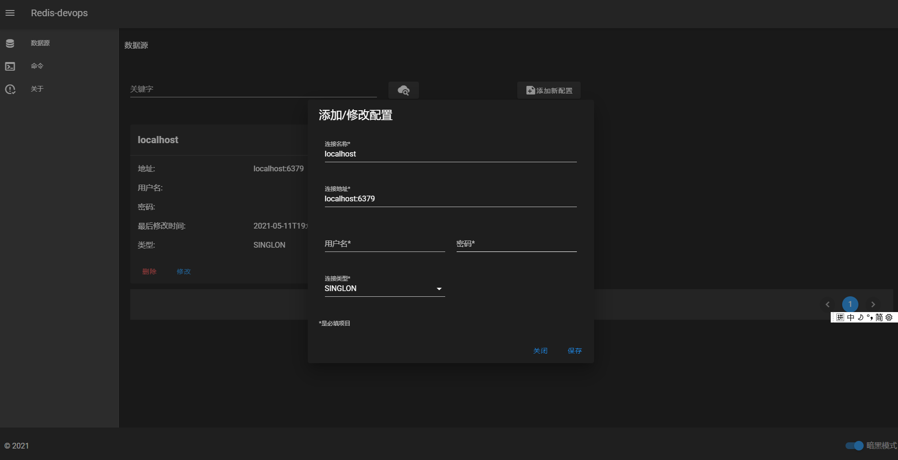
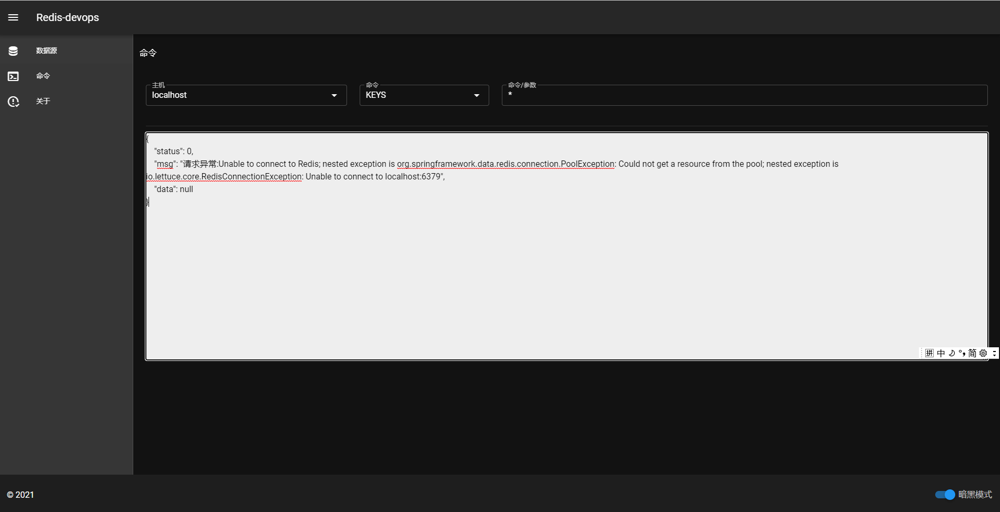

# redis-devops
## 本项目的一些说明
是什么，为什么，怎么做，怎么用
### 为什么与是什么?

在BBT的时候有时会遇到用户找客服询问充值不到账或者充值后用户信息还未及时更新的情况，这样的问题大部分时候是缓存没及时更新的情况。 处理这样的问题最优解肯定是不发生这样的问题。但是总有需要处理的时候，但是我们的集群是部署在内网的，不方便访问，我的同事哇噻君遇到过并吐槽过这问题。 于是我五一得空便写了这个运维工具。是的，这是个Redis运维工具，提供增删改查功能。👌

### 怎么用?

- 首先，启动的时候你应该通过-Dusername和-Dpassword修改登录用户名和密码。默认用户名和密码分别是redis和password(我在win环境下发现用默认登录不进去😂)。-Dserver.port更改端口。
- 然后ip（或者域名）:端口，登录。添加数据源，三类：单机，集群，哨兵。地址格式是：ip:port,ip:port。也就是多个应用地址用,分割。
- 添加完成后到命令界面。你要选择主机和命令类型。other命令类型表示自定义，他需要带命令。其他的只要带参数set类型的参数：key value expTime
- 按回车执行。

### 怎么做?😏

- 后端是一个springboot项目，在每个主机第一次使用的时候构建Lettuce连接池缓存起来。然后就是跑命令
- 前端是个vue项目，本可以前后端分离，但是分离就不方便了。
- logs/是日志目录。-Dlogging.file.path可以设置。database.json是数据源持久文件，启动的时候会读它。格式：

```json
[
	{ 
		"address": "localhost:6379",
		"id": "a4bd9a33-5bd6-4703-a227-b79832343407",
		"modifytime": "2021-05-09T17:24:55.076",
		"name: "localhost-1",
		"password": "",
		"type": "SINGLON",
		"username": "" 
	}
]
```
- 按回车执行。

它长这样：😘
 



**自己探索吧**

**version:0.1.0-SNAPSHOT**